# SIH26248 — Immersive Multi-Domain Decision-Making Trainer

Frontend prototype for Smart India Hackathon 2026 Problem Statement **SIH26248**, proposed by the Ministry of Defence (MoD), Defence Services Staff College.

## Local 360° Media Setup

For local 360° VR video development, place an equirectangular MP4 video at:

```text
public/videos/training360.mp4
```

Alternatively, configure an external object storage / CDN URL in `.env`:

```env
VITE_DEFAULT_360_VIDEO_URL=https://cdn.example.com/training360.mp4
```

## Running Locally

```bash
npm install
npm run dev
```

App will run at `http://localhost:3000`.

## Testing & Verification

```bash
npm test
npm run lint
npm run build
```

# SIH26248 — Immersive Multi-Domain Decision-Making Trainer

### Architecture & Design Diagram Pack

**Project:** Browser-based VR trainer where an instructor degrades communications (delay, loss, conflicting intel) and trainees make timed decisions inside a 360° scene. Output is an After Action Review (AAR).

**Stack (from code):** React 18, TypeScript, Vite, Zustand, Tailwind, Recharts, A-Frame (360° + WebXR), Vitest. **Target backend (contract only):** Django REST + Channels + Redis + PostgreSQL.

> **Status legend:** diagrams 1–2 show what exists today (client-side prototype). Diagrams 3 and 5 mark target-only parts with *(planned)*.

---

## 1. System Architecture (current prototype and target backend)

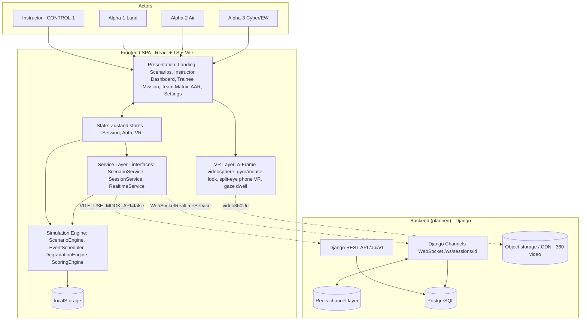

## 2. Frontend Module / Component Diagram

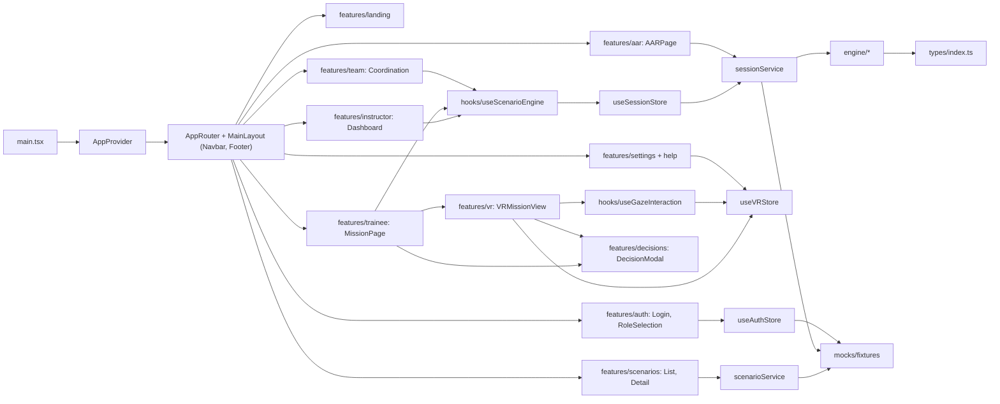

## 3. Class Diagram — Engine, Services, Stores

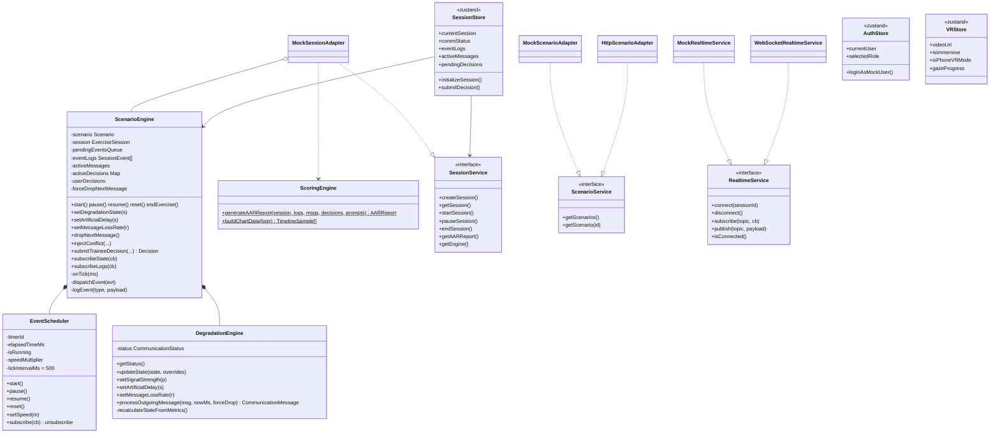

## 4. Class Diagram — Domain Model (`types/index.ts`)

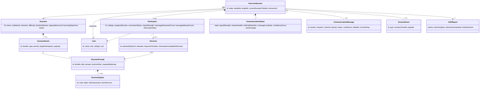

## 5. ER Diagram *(planned persistent schema for the Django backend)*

The prototype has no database. This schema is derived from the TypeScript models and the REST contract. `MESSAGE_DELIVERY` normalises the per-participant `informationState` arrays (received / dropped / delayed / conflicting).

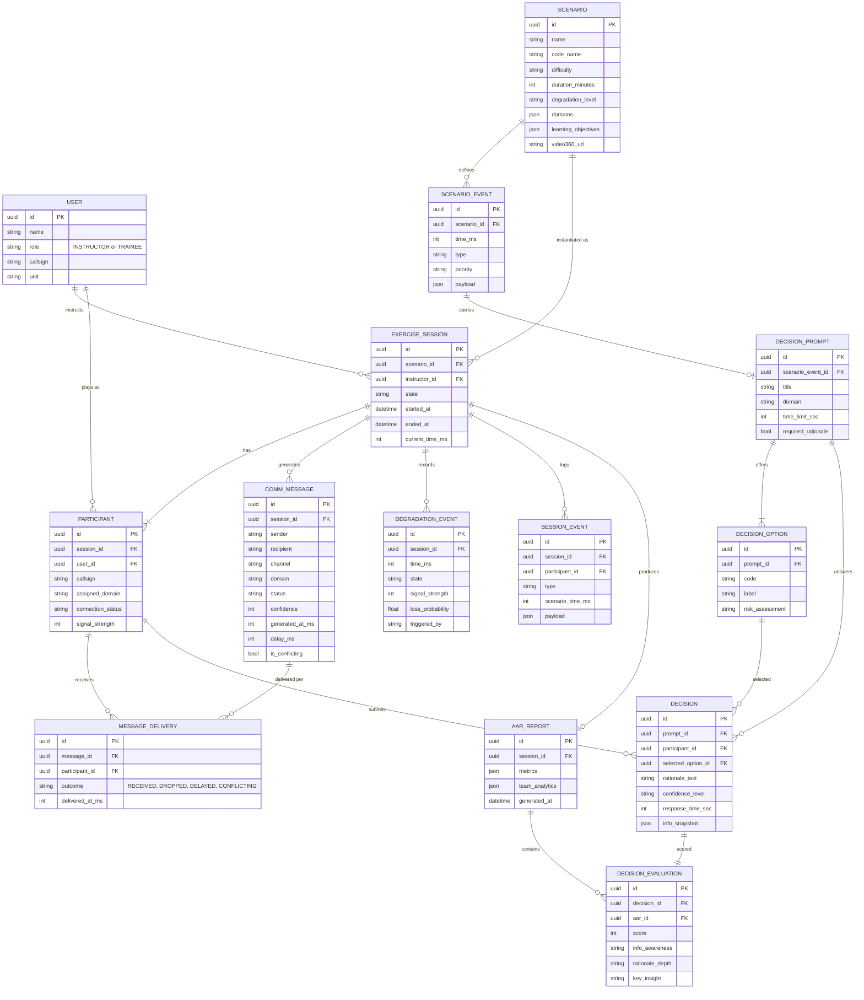

## 6. Flowchart — End-to-End User Flow

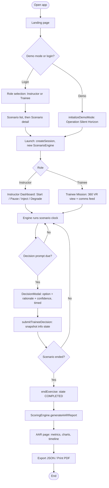

## 7. Flowchart — Message Degradation Pipeline (core logic)

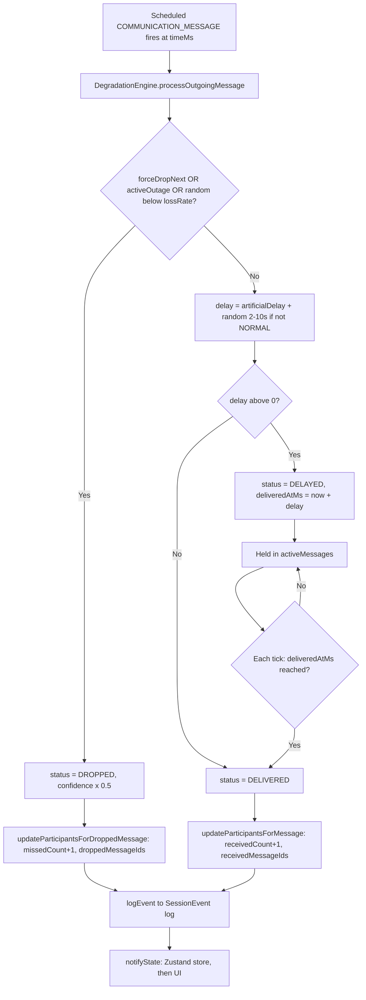

## 8. Sequence Diagram — Decision Lifecycle

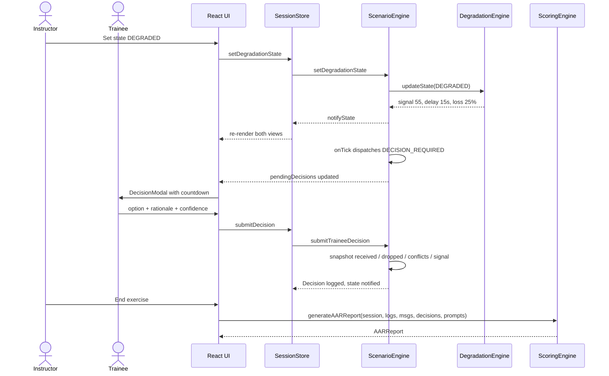

## 9. State Diagrams

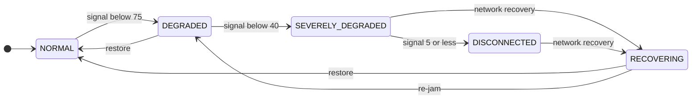

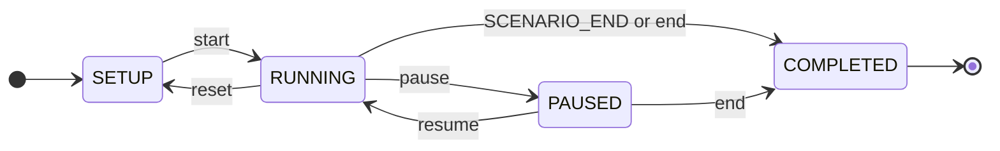

## 10. Methodology

### 10.1 Development methodology

```mermaid
flowchart LR
  A["1 Requirement analysis: PS SIH26248"] --> B["2 Domain modelling: types, scenarios, events"]
  B --> C["3 Engine-first build: Scheduler, Degradation, Scenario, Scoring"]
  C --> D["4 Service contracts: interfaces + mock adapters"]
  D --> E["5 UI: Instructor, Trainee, Team, AAR"]
  E --> F["6 Immersion: 360 video, WebXR, gaze"]
  F --> G["7 Test: Vitest, lint, build"]
  G --> H["8 Backend swap: Django REST + Channels"]
  H --> I["9 Pilot with staff college, iterate scenarios"]
```

### 10.2 Training methodology (how a session teaches)

1. **Brief:** the trainee sees objectives and mission context.
2. **Degrade:** the instructor or scenario timeline lowers signal, adds latency, drops messages and injects conflicting reports.
3. **Decide:** a timed decision prompt requires an option, a written rationale and a confidence level.
4. **Capture:** each decision records exactly what information the trainee had (received, dropped, conflicting, signal).
5. **Review:** the AAR scores decisions and replays the timeline.

### 10.3 Scoring formulas (from `scoringEngine.ts`)

| Metric | Formula |
| --- | --- |
| Decision score | `0.3 x speed + 0.5 x rationale + 0.2 x info` |
| Speed score | `max(0, 100 - 1.6 x responseTimeSec)` |
| Rationale score | `min(100, 2.5 x characters)` (full marks at 40 chars) |
| Info bonus | 100 if no missing critical messages, else 40 |
| Comm reliability % | `delivered / total` |
| Info availability % | `(delivered + 0.5 x delayed) / total` |
| Asymmetry gap % | `(maxReceived - minReceived) / maxReceived` across participants |
| Domain sync score | `100 - 0.6 x asymmetryGap - 8 x droppedCount`, clamped to 0-100 |

### 10.4 Degradation presets (from `degradationEngine.ts`)

| State | Signal | Delay | Loss | Confidence |
| --- | --- | --- | --- | --- |
| NORMAL | 95 | 0s | 0% | 95 |
| DEGRADED | 55 | 15s | 25% | 70 |
| SEVERELY_DEGRADED | 25 | 35s | 55% | 40 |
| DISCONNECTED | 0 | outage | 100% | 10 |
| RECOVERING | 80 | 5s | 8% | 85 |

## 11. Deployment Diagram *(target)*

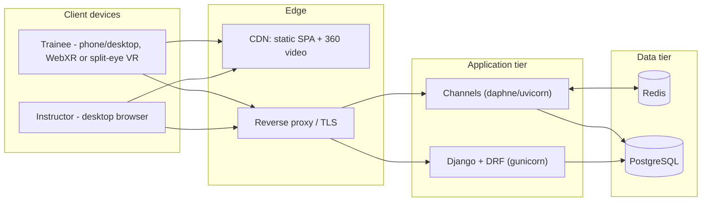